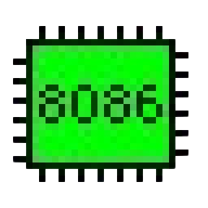

<div align="center">
<h2 align="center" style="color:#1f6feb;">
   

</h2>


<p align="center">
  
  
  
</p>


</div>

---

##  About Me

<div align="center">

<table>
<tr>
<td align="center" width="50%">

###  Profile


**Amir Sakib**  
 BRAC University  
 Dhaka, Bangladesh 🇧🇩  
 ML & Data Science Engineer

</td>
<td align="center" width="50%">

###  Core Skills


**Python** • **JavaScript** • **C++** • **SQL**

 *Building intelligent systems that make a difference*

</td>
</tr>
</table>

</div>

---

<div align="center">

###  Currently Learning

<table>
<tr>
<td align="center" width="25%">
<br>
<sub><b>Advanced DSA</b></sub><br>
<sub>& Algorithms</sub>
</td>
<td align="center" width="25%">
<br>
<sub><b>Deep Learning</b></sub><br>
<sub>Architectures</sub>
</td>
<td align="center" width="25%">
<br>
<sub><b>System Design</b></sub><br>
<sub>Patterns</sub>
</td>
<td align="center" width="25%">
<br>
<sub><b>MLOps</b></sub><br>
<sub>& Deployment</sub>
</td>
</tr>
</table>

###  Currently Building

<table>
<tr>
<td align="center" width="33%">
<br>
<sub><b>AI-Powered</b></sub><br>
<sub>Web Applications</sub>
</td>
<td align="center" width="33%">
<br>
<sub><b>Computer Vision</b></sub><br>
<sub>Projects</sub>
</td>
<td align="center" width="33%">
<br>
<sub><b>Full-Stack ML</b></sub><br>
<sub>Solutions</sub>
</td>
</tr>
</table>

###  Currently Practicing

<table>
<tr>
<td align="center" width="33%">
<br>
<sub><b>LeetCode Daily</b></sub><br>
<sub>Challenges</sub>
</td>
<td align="center" width="33%">
<br>
<sub><b>Kaggle</b></sub><br>
<sub>Competitions</sub>
</td>
<td align="center" width="33%">
<br>
<sub><b>Open Source</b></sub><br>
<sub>Contributions</sub>
</td>
</tr>
</table>


</div>

<div align="center">

##  Technology Stack (Static Logos)

###  AI / ML & LLM Frameworks

<table>
<tr>
<td align="center" width="20%">
<br>
<b>Python</b>
</td>
<td align="center" width="20%">
<br>
<b>TensorFlow</b>
</td>
<td align="center" width="20%">
<br>
<b>PyTorch</b>
</td>
<td align="center" width="20%">
<br>
<b>LangChain</b>
</td>
<td align="center" width="20%">
<br>
<b>NumPy</b>
</td>
</tr>
</table>

---

###  Data Science & Visualization

<table>
<tr>
<td align="center" width="20%">
<br>
<b>Pandas</b>
</td>
<td align="center" width="20%">
<br>
<b>Matplotlib</b>
</td>
<td align="center" width="20%">
<br>
<b>Jupyter</b>
</td>
<td align="center" width="20%">
<br>
<b>SQL</b>
</td>
<td align="center" width="20%">
<br>
<b>Google Colab</b>
</td>
<td align="center" width="20%">
<br>
<b>Kaggle</b>
</td>
</tr>
</table>

---

###  BI, Tools & Platforms

<table>
<tr>
<td align="center" width="20%">
<br>
<b>Power BI</b>
</td>
<td align="center" width="20%">
<br>
<b>Excel</b>
</td>
<td align="center" width="20%">
<br>
<b>GitHub</b>
</td>
<td align="center" width="20%">
<br>
<b>Assembly</b>
</td>
</tr>
</table>

</div>


<div align="center">

<br>

| Category | Technologies |
|----------|-------------|
| **AI/ML** |     |
| **Languages** |     |
| **Web Dev** |     |
| **Data Science** |     |
| **Databases** |     |
| **DevOps & Tools** |     |
| **Visualization** |   |

</div>


## GitHub Analytics

<p align="center">
  
  
</p>


---


## Current Focus Areas

<div align="center">

<table>
<tr>
<td width="50%" valign="top">

###  Machine Learning & AI
```yaml
Focus Areas:
  - Deep Learning Architectures
  - Computer Vision (OpenCV, YOLO)
  - Natural Language Processing
  - Model Optimization & Deployment
  - Neural Network Design
  
Current Projects:
  -  Image Classification System
  -  Chatbot with RAG
  -  Predictive Analytics Dashboard
  -  Large Language Models
```

</td>
<td width="50%" valign="top">

###  Full-Stack Development
```yaml
Technologies:
  - Frontend: React.js, TailwindCSS
  - Backend: Flask, Node.js, FastAPI
  - Database: MongoDB, PostgreSQL
  - DevOps: Docker, CI/CD
  - LangChain Projects
  
Building:
  -  AI-Powered Web Apps
  -  Real-time Analytics Tools
  -  Interactive Dashboards
  - End to end LLMs projects
```

</td>
</tr>
</table>

</div>

---

##  Featured Projects

<div align="center">

###  Explore My Work


<a href="https://github.com/amirsakib16?tab=repositories">
  
</a>

###  Recent Repositories

<!-- Replace these with your actual repository names once you have some repositories -->
<table>
  <tr>
    <td align="center" width="33%">
      <a href="https://github.com/amirsakib16/Caption-Generation-from-Image-using-Vision-Transformer">
        
        <br>
      </a>
    </td>
    <td align="center" width="33%">
      <a href="https://github.com/amirsakib16/ResearchNexus">
        
        <br>
      </a>
    </td>
    <td align="center" width="33%">
      <a href="https://github.com/amirsakib16/ObesityAnalysis_ML_MySQL_PowerBI-Dashboard_FlaskAPI">
        
        <br>
      </a>
    </td>
  </tr>
</table>

</div>

---

##  Contribution Activity

<div align="center" width="90%">


###  Watch My Contributions


<!-- Alternative: Use this animated wave instead -->


</div>

---

##  Let's Connect!

<div align="center">

[](https://www.linkedin.com/in/amir-sakib-saad-2410282a7/)
[](https://www.kaggle.com/amirsakib)
[](https://leetcode.com/u/amirsakib16/)
[](https://your-portfolio.com)
[](mailto:amirsakib16@gmail.com)

###  Get in Touch
**Personal:** amirsakib16@gmail.com  
**Academic:** amir.sakib.saad@g.bracu.ac.bd

</div>

---

<div align="center">


</div>

<div align="center">


</div>

---

<div align="center">
  


###  Thanks for visiting! Let's innovate together! 


</div>

---


